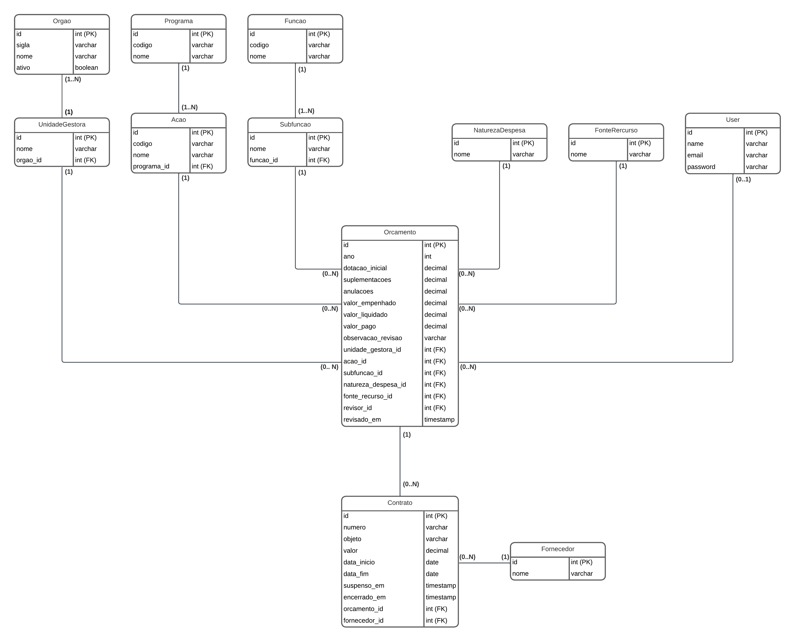

# Execução Local

O Docker já possui todas as dependências necessárias para que a aplicação seja executada na máquina (PHP 8.3, Node 22 e MySQL). Em adição, foi criado um script que na primeira execução roda os seeders que populam o banco de dados, além de instalar as dependências do frontend e deixar as aplicações backend e frontend online.

Assim, após executar o docker compose up, para acessar a aplicação, basta acessar o endereço http://localhost:3000/.


# Escolha do Banco de Dados

Não havia uma preferência clara entre MySQL e PostgreSQL, mas por trabalhar diariamente com o MySQL e estar mais habituado com sua sintaxe, ele foi o meu banco de escolha para criar a aplicação.


# Idioma do Código

Geralmente programo sempre em inglês, seja para o nome das entidades, funções, variáveis, parâmetros, atributos etc. Contudo, por se tratar de um sistema que lida com termos específicos do ramo, preferi utilizar o português para qualquer nomeação no código, de modo a prevenir traduções incorretas, além de poder dificultar o entendimento do código.


# Backend
#### Autenticação JWT

- Considerando que seria utilizada a autenticação via JWT, criei migrations para remover o campo remember_token da tabela users e a tabela personal_access_tokens, pois ambos não seriam mais utilizados. No mesmo momento também removi o campo email_verified_at, que não seria útil no contexto do desafio.

- Para implementar o JWT no Laravel, utilizei a biblioteca[ jwt-auth](https://github.com/PHP-Open-Source-Saver/jwt-auth), instalando através do seguinde comando:

```bash
composer require php-open-source-saver/jwt-auth php artisan vendor:publish --provider="PHPOpenSourceSaver\JWTAuth\Providers\LaravelServiceProvider" php artisan jwt:secret
```

#### Estratégia de expiração do token

Para manter a implementação da autenticação simples, e por não haver, no escopo deste desafio, um front-end que precise de renovação silenciosa de sessão, optei por não utilizar refresh token, e ao invés disso, fazer com que, quando o token expira, seja retornado `401 Unauthorized` na próxima requisição, com o seguinte Json:

```
{
  "message": "Token expirado. Faça login novamente.",
  "error": "token_expired"
}
```

Assim, o frontend fica responsável por identificar esse retorno e redirecionar o usuário para a tela de login.

No .env da aplicação foi criado um parâmetro JWT_TTL em que é possível configurar a vida útil de um token.


# Migrations

Para ser possível entender a estrutura do banco de dados, foi fundamental iniciar a modelagem criando um MER (Modelo Entidade Relacionamento) a partir das definições do sistema apresentadas no desafio (funcionando basicamente como uma descrição do minimundo), como é possível ver abaixo:



Na criação das migrations, adicionei nullable em todos os campos de forma proposital para permitir que os seeders criem registros inconsistentes com campos nulos que deveriam ser obrigatórios.

Para campo de ano, utilizei small integer não assinado pois suporta valores até 65.535, ocupando menos espaço que o Integer padrão.

Para valores monetários usei o decimal de tamanho 15 para ser capaz de armazenar até a casa de trilhões.

Se tratando de um sistema que armazena o histórico de despesas do governo, adicionei restrictOnDelete em todos os relacionamentos, pois na ideia do negócio não há a necessidade de exclusão de uma entidade, especialmente no caso de órgão que já existe o status ativo ou inativo, que já funciona de certa forma como uma exclusão lógica.

Orçamentos - Como cada chave estrangeira já cria um índice, achei válido criar também um índice para "ano", de modo a tornar consultas mais velozes.

Em adição, não relacionei diretamente orçamento com órgão, pois orçamento já se relaciona a unidade gestora, que por sua vez sempre se relaciona com um órgão. Assim, evita-se qualquer tipo de inconsistência de valores (como por exemplo o órgão de um orçamento ser alterado mas a unidade gestora não).

Contratos - Criei um índice com 'encerrado_em', 'suspenso_em' e 'data_fim', pois esses campos são utilizados para definir o status do contrato, o que pode ser utilizado como filtro no GET de contratos. Assim, o índice ajuda a tornar a consulta mais veloz quando aplicado o filtro de status.


# Estrutura das Camadas

Apesar de no contexto do desafio os atributos retornados pela API serem basicamente os mesmo atributos dos models, optei por utilizar a camada de Resources, que atuam basicamente como DTOs, estruturando as entidades a serem retornadas pelo endpoint, de modo a simular um cenário real em que é necessário trazer mais controle e segurança do que é exposto de cada model.

Ainda visando simular um contexto real, também utilizei classes de service para separar lógica e regras de negócio do controller, bem como classes de repositories para isolar a comunicação com o banco de dados.

Para o tratamento dos requests de cada endpoint, optei por tirar as validações do repository e isolá-las em classes do tipo Form Requests, permitindo ao repository (salvo exceções específicas) apenas utilizar os filtros nas queries, sem ter que verificar se são válidos.


# Models

Para declarar scopes nos models, utilizei a forma mais recente introduzida no Laravel 12, em que se importa a classe Illuminate\Database\Eloquent\Attributes\Scope e declara o método utilizando acima dele o atributo #[Scope].

Como Orçamentos se relaciona indiretamente com órgão (afinal UnidadeGestora é quem faz essa ligação), criei no model Orçamentos um relacionamento do tipo hasOneThrough, que retorna o órgão. Esse tipo de relacionamento foi uma alternativa nativa encontrada para suprir a necessidade de um relacionamento BelongsThrough, que não existe sem biblioteca externa.

Ainda no model Orçamentos, havia a possibilidade de fazer com que sempre que o campo "revisor" fosse modificado, fosse salvo automaticamente o momento de agora no campo "revisado_em". Contudo, pensando no cenário de importação de contratos já existentes e revisados para o sistema, a data de revisão não poderia ser sobrescrita pela data de agora. Dessa forma, optei por setar a data na função do endpoint PATCH, no controller.


# Endpoints

No caso do endpoint GET /orgaos, precisei verificar no repository se o filtro 'ativo' é passado, para que assim seja possível três possibilidades de resultados: ativo "true" (retorna somente órgãos ativos), ativo "false" (retorna somente órgãos inativos), ou ativo ausente no request (retornando todos os órgãos).

Realizei também a criação de endpoints adicionais GET /programas e GET /acoes, para que fosse possível utilizá-los para popular os selects de filtro das telas de contratos e orçamentos.


# Seeders e Factories

OrcamentoFactory - Utilizei fake()->boolean(90) nos atributos para ter 10% de chance de os atributos serem nulos ou terem valores inconsistentes.

Além disso, deixei os campos de revisão nulos em todos os orçamentos gerados uma vez que é possível revisar através do endpoint PATCH /orcamentos/:id/revisao


# Frontend

Escolhi utilizar o bootstrap para a estilização visando os componentes que a ferramenta oferece, permitindo assim criar a aplicação mais rapidamente dado o curto prazo para conclusão.

Foi utilizada inteligência artificial para ser possível entender como implementar a autenticação via JWT especificamente no React, pois previamente a este desafio minha experiência era somente de implementar utilizando outros frameworks.

Assim, ao receber o token pelo endpoint de login, ele é armazenado no localStorage, e antes de cada requisição ser executada, o interceptor adiciona o token. Se a API responder 401, indica que o token foi expirado, sendo então removido e o usuário direcionado à tela de login.

Além disso, é extraído o e-mail do usuário do atributo preferred_username, para que possa ser utilizado na barra superior da tela.

Por fim, também houve o apoio de inteligência artifical para entender qual opção de biblioteca de gráficos utilizar, bem como entender como  implementá-la. Dessa forma, optei por utilizar a biblioteca Recharts por ser uma das opções mais populares no mercado.